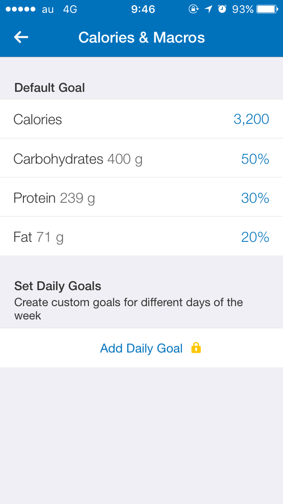

# PFCバランス
食事管理の考え方

---

## 何を意識して食事してますか？

---

* 美味しいもの
* 甘いもの
* 家系ラーメン
* 大盛、特盛、メガ盛
* マック、コーラ
* テレビで紹介されたダイエット食
* 無意識

---

* ~~美味しいもの~~
* ~~甘いもの~~
* ~~家系ラーメン~~
* ~~大盛、特盛、メガ盛~~
* ~~マック、コーラ~~
* ~~テレビで紹介されたダイエット食~~
* ~~無意識~~

---

## 損してます

---

## 食事の摂り方を意識することで
* 体調が良くなる
* 効率よく健康に痩せる
* 筋肉が付く
* パフォーマンスがあがる

など、色々効果が表れます。

---

食事を摂る時に意識すること

## 摂取カロリー と PFCバランス

---

## 摂取カロリー >= 基礎代謝

男性: `10*体重(kg) + 6.25*身長(cm) - 5*年齢(歳) + 5 = 基礎代謝`

女性: `10*体重(kg) + 6.25*身長(cm) - 5*年齢(歳) + 161 = 基礎代謝`

例） `10*70.9(kg) + 6.25*169(cm) - 5*24(歳) + 5 = 1650kcal`

---

## 摂取カロリーが基礎代謝を下回ってはいけない理由
* 下回ると。。。
	* 筋肉が減る　＝　基礎代謝が下がる
	* 全てのパフォーマンスが下がる
	* 免疫力低下、肌荒れ、etc...

---

## 「PFC」とは

* Protein: たんぱく質
	* **筋肉、内蔵、肌、髪、爪など、身体のありとあらゆるパーツの材料になる最も重要な栄養素。**
* Fat: 脂質
	* **関節の健康や脳の働き、ホルモン分泌や脂肪燃焼においても必須の栄養素。**
* Carbohydrate: 炭水化物
	* **主に人間が活動するために使用され、身体や脳を動かすエネルギーとなる。**

---

## PFCバランス
* Protein: たんぱく質 1g=4kcal
	* 体重 * 1~1.5 (g)
* Fat: 脂質 1g=9kcal
	* 摂取カロリーの20~25%程
* Carbohydrate: 炭水化物 1g=4kcal
	* 摂取カロリー - (たんぱく質 + 脂質）= 炭水化物

---

---

## 「どれだけいい運動も、悪い食習慣は倒せない」

---

## 参考・引用
* 筋トレビジネスエリートがやっている最強の食べ方
	* https://www.amazon.co.jp/%E7%AD%8B%E3%83%88%E3%83%AC%E3%83%93%E3%82%B8%E3%83%8D%E3%82%B9%E3%82%A8%E3%83%AA%E3%83%BC%E3%83%88%E3%81%8C%E3%82%84%E3%81%A3%E3%81%A6%E3%81%84%E3%82%8B%E6%9C%80%E5%BC%B7%E3%81%AE%E9%A3%9F%E3%81%B9%E6%96%B9-Testosterone/dp/404602013X/ref=sr_1_2?s=books&ie=UTF8&qid=1501806975&sr=1-2&keywords=testosterone
* DIET GENIUS マクロ計算機
	* https://dietgenius.jp/macro-nutrient-calculator/
* myfitnesspal
	* https://www.myfitnesspal.com/ja