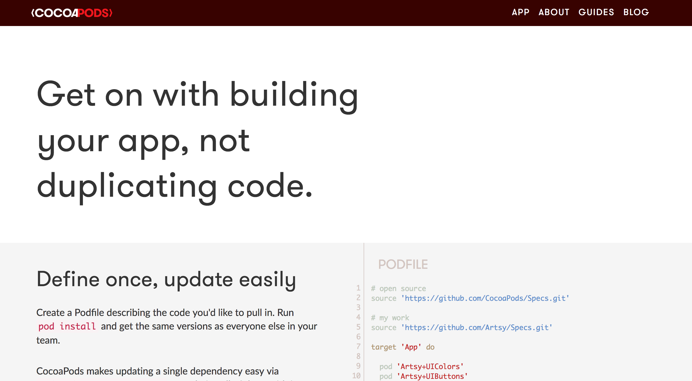
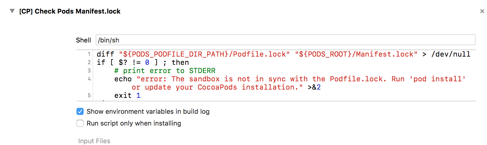
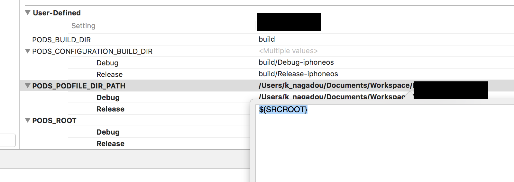
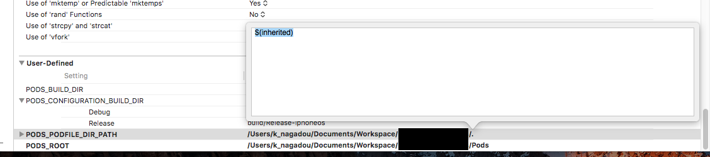

# CocoaPods v0.39.0 -> v1.2.1

<br><br><br><br><br><br><br><br><br><br>

公開にあたって、機密情報にあたる部分は隠しています。
（見つけても、見逃してください）


---

<!-- page_number: true -->

CocoaPodsをバージョンアップしようとしたら、
色々ハマって解決した話。

---

# diff: /Podfile.lock: No such file or directory

```
Shell Script Invocation Error Group
diff: /Podfile.lock: No such file or directory
diff: /Manifest.lock: No such file or directory
error: The sandbox is not in sync with the Podfile.lock. 
Run 'pod install' or update your CocoaPods installation.
```

CocoaPodsをv1.2.1にして、pod installを実行。
すると、ビルド時に以下エラー発生。

---

pod install / update を実行時には、以下Warningsが出る
```bash
[!] CocoaPods did not set the base configuration of your project
because your project already has a custom config set. 
In order for CocoaPods integration to work at all, please 
either set the base configurations of the target 
`xxxx<TargetName>` to `Pods/Target Support Files/Pods-xxxx<TargetName>/Pods-xxxx<TargetName>.debug.xcconfig` or include the `Pods/Target Support Files/Pods-xxxx<TargetName>/Pods-xxxx<TargetName>.debug.xcconfig` in your build configuration (`hoge/xxxx<TargetName>.xcconfig`).
#プロジェクトにすでにカスタム設定があるため、CocoaPodsは
#プロジェクトの基本設定を設定しませんでした。 CocoaPodsの統合が
#まったく機能するためには、ターゲット `xxxx<TargetName>`の基本設定を
#` Pods / Target Support Files / Pods-xxxx<TargetName> /
#Pods-xxxx<TargetName>.debug.xcconfig`に設定するか、 `Pods /
#Target Support ビルド設定（ `hoge / xxxx<TargetName>.xcconfig`）に
#「Files / Pods-xxxx<TargetName> / Pods-xxxx<TargetName>.debug.
#xcconfig`」と入力します。
~以下略~
```

---

エラーを吐いているヤツは？？
→`pod install`でプロジェクトのBuild Phasesに設定されるスクリプトだった


---

## Build SettingsのUser-Definedに以下設定すると解消された

`PODS_PODFILE_DIR_PATH`, `PODS_ROOT`の値を指定


---

# Lexical or Preprocessor Issue Group


```
Lexical or Preprocessor Issue Group
/Users/k_nagadou/Documents/Workspace/Hoge/Resource/
xxxx<TargetName>-Prefix.pch:17:13: 'SVProgressHUD.h' file not found
```

次はこのエラーが発生
`pod install`したライブラリが見つからない？？

---

## xcconfigの`#include`を以下のように修正


```
#include "Pods/Target Support Files/Pods-xxxx<TargetName>/Pods-xxxx<TargetName>.debug.xcconfig"
#include "Pods/Target Support Files/Pods-xxxx<TargetName>/Pods-xxxx<TargetName>.release.xcconfig"
```

一旦、これでビルドが通るようになった。
>※Pods側のxcconfigファイルには
`HEADER_SEARCH_PATHS`, `LIBRARY_SEARCH_PATHS`といった環境変数がセットされているため、どこかで指定してあげる必要があるのだろう。

---

しかし、再度`pod install`した時に、別のWarningsが出るようになった。
```
[!] The `xxxx<TargetName> [Debug]` target overrides the 
`PODS_PODFILE_DIR_PATH` build setting defined in 
`Pods/Target Support Files/Pods-xxxx<TargetName>/Pods-
xxxx<TargetName>.debug.xcconfig'. This can lead to problems with 
the CocoaPods installation
    - Use the `$(inherited)` flag, or
    - Remove the build settings from the target.

~以下略~
```

---

## Build SettingsのUser-Definedの以下設定をinheritedに修正



**※各ターゲットのxcconfigではなく、Build Settingsに設定しないとビルドが通らない**

---

# End